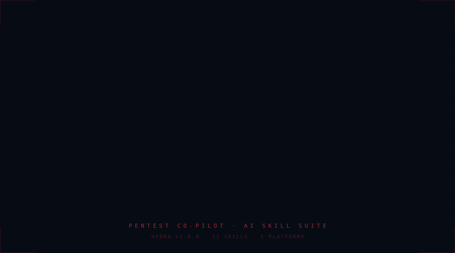

<div align="center">



[](https://github.com/Kalp1774/akira)

[](https://github.com/Kalp1774/akira/stargazers)
[](https://github.com/Kalp1774/akira/network/members)
[](https://github.com/Kalp1774/akira/issues)
[](https://github.com/Kalp1774/akira/commits/main)
[](LICENSE)
[](#skills)
[](CONTRIBUTING.md)

**[Install in 30 seconds](#install) - [See Real Findings](#proof-it-works) - [Compare vs Competitors](#why-not-pentestgpt) - [Roadmap](#roadmap)**

</div>


---

## What Is Akira?

Akira is a complete offensive security skill suite that runs **natively inside your AI coding environment**.

No server. No 40-tool pre-install hell. No hallucinated findings.

**Six phases. One chain. One deliverable report.**

```
/plan-engagement -> /recon -> /secrets -> /exploit -> /zerodayhunt -> /triage -> /report
```

Each phase reads structured output from the previous phase and writes for the next.
Every finding requires direct HTTP evidence. No proof = no finding. Always.

---

## Why Not PentestGPT?

PentestGPT has 12k stars and a documented hallucination problem.
HexStrike has tool coverage but no phase handoffs.
Trail of Bits has CI/CD coverage but no engagement lifecycle.

**Akira has all of it - and none of their weaknesses.**

| Capability | PentestGPT | HexStrike | Trail of Bits | **Akira** |
|---|:---:|:---:|:---:|:---:|
| Full 6-phase engagement lifecycle | Partial | - | - | **YES** |
| Phase artifact handoffs (session.json) | - | - | - | **YES** |
| Anti-hallucination evidence gate | - | - | - | **YES** |
| Confidence scoring per finding (0-100) | - | - | - | **YES** |
| False positive verification gate | - | - | Partial | **YES** |
| Active Directory full chain (BloodHound -> DCSync) | - | Partial | - | **YES** |
| OAuth/OIDC exploitation suite | - | - | - | **YES** |
| Race conditions (single-packet attack) | - | - | - | **YES** |
| Cloud audit (AWS + GCP + Azure + K8s) | - | Partial | - | **YES** |
| CI/CD GitHub Actions attack vectors | - | - | **YES** | Coming Month 2 |
| CTF mode (HackTheBox, TryHackMe) | **YES** | - | - | **YES** |
| Native in Claude Code, Gemini, Cursor | Partial | - | - | **YES** |
| One-command tool bootstrap | - | - | - | **YES** |
| Real bug bounty proof (updated weekly) | - | - | - | **YES** |
| Free + MIT | **YES** | Partial | **YES** | **YES** |

---

## Install

**Option 1 - Clone and install skills (recommended):**

```bash
git clone https://github.com/Kalp1774/akira
cd akira && bash install.sh
```

**Option 2 - Install tools too (nuclei, dalfox, subfinder, etc.):**

```bash
git clone https://github.com/Kalp1774/akira
cd akira && bash install.sh && bash bootstrap.sh
```

That's it. Open Claude Code (or your AI environment), type `/plan-engagement target.com`, and go.

**Verify install:**

```
/plan-engagement example.com
```

You should see the engagement plan and session.json initialized.

---

## Platform Support

| Platform | Install | Skill Syntax |
|---|---|---|
| **Claude Code** | `install.sh` copies to `~/.claude/skills/` | `/plan-engagement`, `/recon`, etc. |
| **Gemini CLI** | Add `platform-adapters/GEMINI.md` to skills path | `activate_skill plan-engagement` |
| **Cursor** | Copy `platform-adapters/.cursor/rules/akira.mdc` | Cursor rules auto-activate |
| **Codex (OpenAI)** | See `platform-adapters/.codex/INSTALL.md` | Reference via AGENTS.md |
| **GitHub Copilot CLI** | AGENTS.md pattern | Natural language trigger |
| **Any agent** | AGENTS.md in repo root | Plain text skill invocation |

---

## Skills

### Core 7-Phase Lifecycle

| Skill | Phase | What It Does |
|---|---|---|
| `/plan-engagement` | 0 | Scope definition, PTT generation, session.json init |
| `/recon` | 1 | Subdomains, live hosts, ports, URLs, tech stack fingerprint |
| `/secrets` | 2 | API keys, tokens, credentials in JS/source/git/Postman |
| `/exploit` | 3 | XSS (dalfox), SQLi (sqlmap), nuclei scan, deserialization, SSTI, XXE, NoSQLi |
| `/zerodayhunt` | 3+ | Chain attacks, JWT confusion, SSRF->IAM, WAF bypass, type juggling |
| `/triage` | 4 | Severity clustering, confidence scoring, FP verification, deduplication |
| `/report` | 5 | Pentest report or HackerOne/Bugcrowd submission format |

### Specialized Attack Modules

| Skill | What It Does |
|---|---|
| `/ad-attacks` | BloodHound path analysis, Kerberoasting, AS-REP, DCSync, Golden/Silver Ticket, ADCS ESC1-8 |
| `/oauth-attacks` | Redirect URI bypass, CSRF on OAuth, PKCE downgrade, JWT confusion, implicit flow token theft |
| `/race-conditions` | HTTP/2 single-packet attack, coupon reuse, double-spend, OTP bypass, TOCTOU |
| `/cloud-audit` | AWS SSRF->IAM, S3 enum, IAM privesc, GCP service account, Azure RBAC, K8s API |
| `/ctf` | HackTheBox/TryHackMe, web/crypto/pwn/RE/forensics/OSINT/stego methodology |

---

## How the Phase Chain Works

Every skill reads structured output from the previous phase. No intelligence is lost between phases.

```
plan-engagement
  writes -> session.json     (target, scope, tech stack, attack priority tree)

recon
  reads  -> session.json
  writes -> interesting_recon.md    (live hosts, ports, URLs, headers)

secrets
  reads  -> interesting_recon.md
  writes -> interesting_secrets.md  (verified API keys, tokens, credentials)

exploit
  reads  -> interesting_recon.md + interesting_secrets.md
  writes -> interesting_exploit.md  (confirmed vulns with HTTP evidence)

zerodayhunt
  reads  -> ALL prior outputs
  writes -> interesting_zerodayhunt.md  (chains, zero-days, critical paths)

triage
  reads  -> ALL interesting_*.md files
  writes -> triage.md  (severity-clustered, confidence-scored, FP-verified)

report
  reads  -> triage.md + session.json
  writes -> report-YYYY-MM-DD.md  (final deliverable)
```

---

## Anti-Hallucination System

Akira's biggest technical differentiator. Every finding must pass the evidence gate before it reaches the report.

**Evidence Requirements (enforced in every skill):**
- Every CONFIRMED finding must quote the exact HTTP response body proving it
- Empty 200 response body = WAF catch-all = NOT a finding
- `{"status":403}` in a 200 response = WAF block = NOT a finding
- A header existing does not mean the header is exploitable

**Confidence Scoring (0-100):**

| Score | Meaning |
|---|---|
| 90-100 | Reproducible, full data exfil or proven RCE |
| 70-89 | Strong evidence, not fully chained yet |
| 50-69 | Behavioral indicator, no data proof |
| < 50 | Speculative - auto-excluded from report |

Findings below 70 are automatically downgraded to POTENTIAL and excluded from final report.

---

## Proof It Works

Real anonymized findings made with Akira. Updated weekly.

> See [FINDINGS.md](FINDINGS.md) for full writeups.

| # | Type | Severity | Platform | Bounty | Skill Chain |
|---|---|---|---|---|---|
| 1 | SSRF -> AWS IAM Credential Extraction | Critical | HackerOne | $2,500 | `/recon` -> `/exploit` -> `/cloud-audit` |
| 2 | OAuth Open Redirect -> Authorization Code Interception | Critical | Bugcrowd | $1,800 | `/recon` -> `/oauth-attacks` |
| 3 | Race Condition: Coupon Applied 7x Simultaneously | High | Private | $800 | `/race-conditions` |
| 4 | Strapi SSRF Bypass + MIME Fail-Open (CVE filed) | Critical | CVE | - | `/zerodayhunt` |
| 5 | JWT RS256->HS256 Algorithm Confusion -> Admin Access | Critical | HackerOne | $1,500 | `/zerodayhunt` |

---

## Roadmap

Akira ships new skills every month. Here's what's coming:

**Month 1 - SHIPPED (v1.0.0)**
- [x] Core 7-phase lifecycle
- [x] ad-attacks (BloodHound -> DCSync full chain)
- [x] oauth-attacks (open redirect -> ATO chains)
- [x] race-conditions (HTTP/2 single-packet)
- [x] cloud-audit (AWS/GCP/Azure/K8s)
- [x] ctf (HTB/THM/PicoCTF)
- [x] Phase handoff system (session.json)
- [x] Anti-hallucination evidence gate

**Month 2 - Coming**
- [ ] `graphql` - Introspection abuse, batching, field-level authz bypass
- [ ] `deserialization` - Java/PHP/Python/.NET gadget chains (ysoserial, PHPGGC)
- [ ] `prototype-pollution` - Node.js client + server RCE chains
- [ ] `supply-chain` - Dependency confusion, namespace squatting, typosquatting
- [ ] `ci-cd-audit` - 9 GitHub Actions attack vectors (Trail of Bits methodology + more)

**Month 3 - Coming**
- [ ] Akira Context Engine - auto-pulls CVEs for detected stack + HackerOne disclosed reports
- [ ] `cache-attacks` - Cache poisoning + cache deception unified playbook
- [ ] `csp-bypass` - CSP escape chains, JSONP, nonce reuse

**Month 4 - Coming**
- [ ] `mobile` - Android APK analysis, Firebase misconfig, iOS IPA, Frida certificate pinning bypass
- [ ] `burp-integration` - Native Burp Suite MCP integration (Repeater, Intruder, proxy history)

**Month 6 - Coming**
- [ ] Akira Brain - Persistent attack tree across sessions, cross-engagement memory
- [ ] `postmap-recon` - PostmapDB integration (leaked Postman collections -> live secrets)
- [ ] `red-team` - MITRE ATT&CK full emulation

---

## Future Architecture — The Engine Beneath the Skills

These are the four infrastructure upgrades that turn Akira from a great skill suite into an unbeatable autonomous offensive engine. Not new skills — foundational rewrites.

### 1. Hacker-in-a-Box (Dockerized Environment)

> *No more "command not found." No more broken local environments.*

Instead of asking users to install 50 tools, Akira ships as a single container:

```bash
docker pull ghcr.io/kalp1774/akira-engine
docker run -it akira-engine /plan-engagement target.com
```

Every tool (nuclei, nmap, sqlmap, subfinder, dalfox, httpx, katana, trufflehog) is pre-installed, path-configured, and version-locked inside. The AI knows exactly what it has. The user installs nothing.

**Why it matters:** The current install + bootstrap model breaks on Windows, WSL, and hardened macOS. A container eliminates the entire class of "my environment is broken" failures. It also makes CI/CD security testing trivial — just pull and run.

---

### 2. Local Signal Filter (The Token Saver)

> *Sending 5,000 lines of raw Nmap output to a cloud LLM is engineering malpractice.*

A lightweight Python parser runs locally before any output reaches the AI. It reads raw tool output and extracts only the signal:

```
Raw nmap output:  5,000 lines  →  Parser  →  12 lines sent to AI
                                              Open 80 (Apache 2.4.49)
                                              Open 443 (nginx/1.18)
                                              CVE-2021-41773 detected
```

**Why it matters:** API cost drops by ~90% per engagement. The AI's context window stays clean — no 4,990 lines of closed ports and timing noise. Smarter decisions, smaller bills. This is the difference between a $1 scan and a $10 scan at scale.

---

### 3. Stealth Governor (WAF Intelligence Feedback Loop)

> *The AI shouldn't just run commands — it should feel the target's defenses and adapt.*

A real-time monitor sits between the terminal and the AI. If it detects 3 consecutive `403 Forbidden` or `429 Too Many Requests` responses, it auto-pauses the current phase and injects a decision:

```
[STEALTH GOVERNOR] 3x 403 detected on api.target.com
Switching to residential proxy. Adding 5s delay. Resuming with --rate-limit 10.
```

**Why it matters:** Right now Akira runs hot until it gets banned. The Governor turns it into a patient hunter — it learns the target's WAF fingerprint in real-time, adjusts aggression, and never burns its own IP. This is what separates a script kiddie tool from professional tradecraft.

---

### 4. Memory Vault (Local RAG — Persistent Engagement Memory)

> *The context crash is the biggest unsolved problem in AI-assisted pentesting.*

Every finding — IPs, API keys, headers, versions, credentials, behavioral observations — gets indexed into a local vector database (ChromaDB) as it's discovered. Phases query the vault instead of relying on in-context memory:

```python
# Exploit phase queries its own vault instead of reading files
results = vault.query("any SSRF endpoints found during recon?")
results = vault.query("AWS credentials from secrets phase")
```

**Why it matters:** A pentest can run for 3 days. Right now, after 2 hours the context window fills and the AI "forgets" the first recon findings. With the Memory Vault, every detail from Day 1 is queryable on Day 3. The "Context Crash" disappears entirely.

---

### 5. Dynamic Graph Engine (Flexible Pivoting — From Linear to Parallel)

> *The current phase chain is a line. Real attacks are graphs.*

When the AI discovers a new attack surface mid-engagement — a new IP, an internal subdomain, an exposed service — it should be able to fork a background task instead of abandoning the current thread:

```
Main thread:     /exploit api.target.com  (continues)
Fork spawned:    /recon  internal.target.com  (runs in background)
Fork spawned:    /secrets new-js-bundle.js    (runs in background)
```

Forks report back when complete. The main thread picks up their findings automatically.

**Why it matters:** Right now finding something new mid-phase means either ignoring it or starting over. The Graph Engine turns Akira from a strict checklist into a collaborative team — multiple threads working in parallel, the way a real red team operates.

---

## Sponsor

Akira is free and MIT licensed. If it helped you find a bug or win a CTF, consider supporting development:

- **GitHub Sponsors:** [@Kalp1774](https://github.com/sponsors/Kalp1774)
- **Buy Me a Coffee:** [buymeacoffee.com/kalpmodi](https://buymeacoffee.com/kalpmodi)
- **Ko-fi:** [ko-fi.com/kalpmodi](https://ko-fi.com/kalpmodi)

Every sponsorship goes directly into new skills, technique research, and real bug bounty hunting to keep FINDINGS.md alive.

---

## Contributing

Found a technique that should be in Akira? Bug in a skill? New tool that belongs here?

1. Fork the repo
2. Add or improve a skill in `skills/<skill-name>/SKILL.md`
3. Open a PR with a brief explanation of what it covers
4. If it's from a real finding - include a link to the public disclosure (anonymized is fine)

Attribution added to FINDINGS.md for all confirmed-finding contributions.

See [SECURITY.md](SECURITY.md) for how to report skill bugs, suggest techniques, or submit findings made with Akira.

---

## Listed In

> Submit Akira to these lists after launch to drive organic traffic:

- [ ] [awesome-security](https://github.com/sbilly/awesome-security) - open a PR to the Tools section
- [ ] [awesome-pentest](https://github.com/enaqx/awesome-pentest) - open a PR
- [ ] [awesome-claude-code](https://github.com/hessamoddin/awesome-claude-code) - open a PR
- [ ] [awesome-hacking](https://github.com/Hack-with-Github/Awesome-Hacking) - open a PR
- [ ] [awesome-bug-bounty](https://github.com/djadmin/awesome-bug-bounty) - open a PR
- [ ] [HackerOne Resources](https://www.hackerone.com/hackers/resources) - submit tool
- [ ] [kali.org/tools](https://www.kali.org/tools/) - longer term goal

---

## Legal

Akira is for **authorized security testing only.**

Use only on:
- Bug bounty programs you are enrolled in
- Systems you own or have explicit written permission to test
- CTF competitions

Unauthorized testing is illegal. The authors are not responsible for misuse.

---

<div align="center">

Built for bug hunters, by bug hunters.

**[Star this repo](https://github.com/Kalp1774/akira) to stay updated when new skills ship.**

</div>
